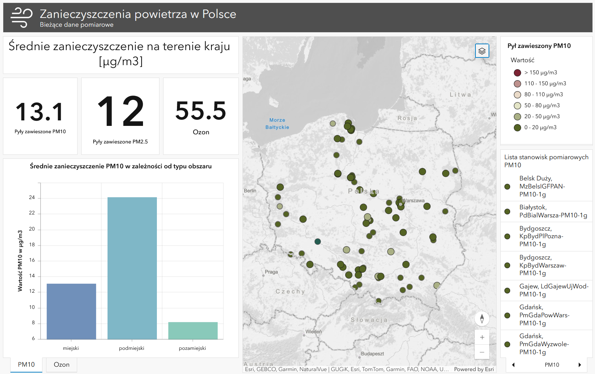

# Air pollution in Poland

Dashboard presenting real-time data based on results provided by the GIOŚ API https://powietrze.gios.gov.pl/pjp/content/api
Until January 1, 2024 data was automatically updated within ArcGIS Online once a day at 8:00 PM.

#### Dashboard  includes:
-	an interactive map depicting measurement results of suspended particulate matter PM10, PM25 and ozone at individual monitoring stations  
-	indicators of average pollution levels across the country  
-	charts of average PM10 and ozone pollution depending on the type of area
-	list of all monitoring stations enabling quick localization on the map     
 

